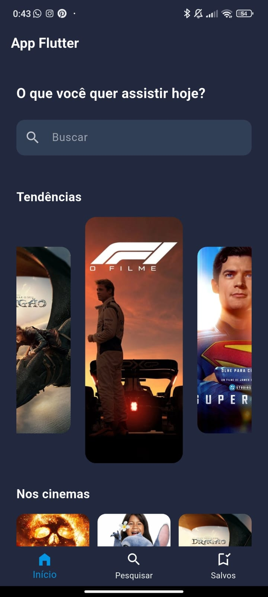
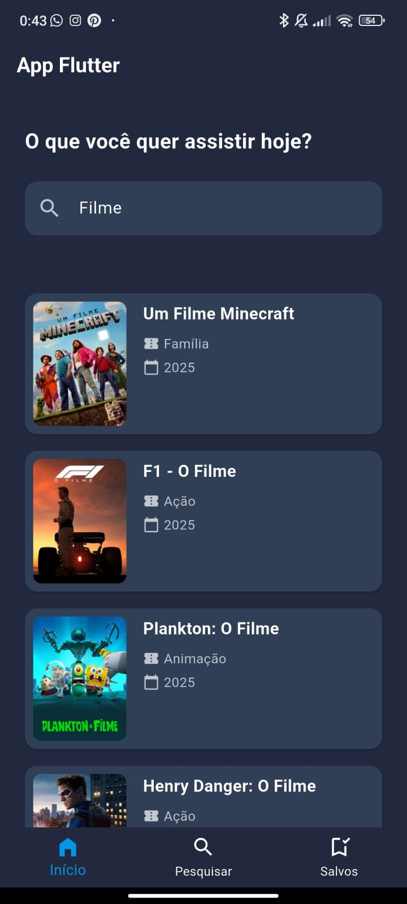
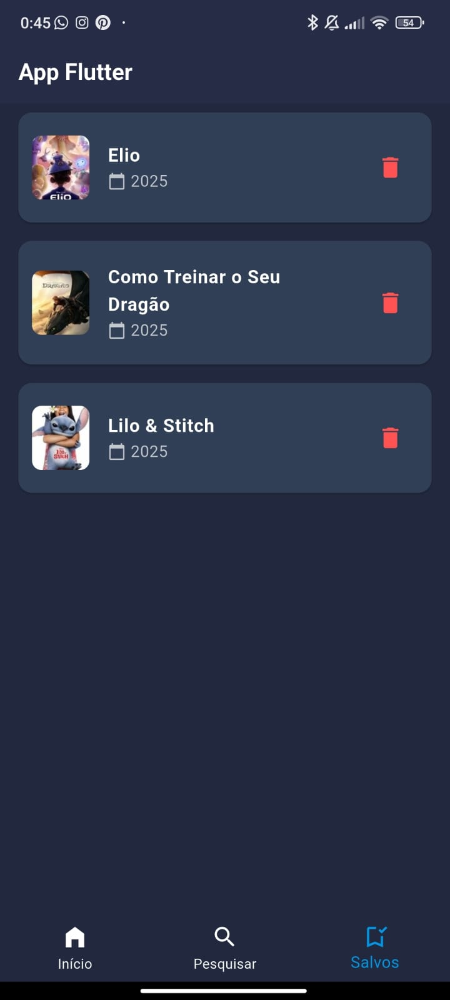

# 🎬 App Flutter - Buscador de Filmes

Aplicativo desenvolvido em Flutter e Dart. O app permite ao usuário buscar filmes, visualizar tendências, conferir os lançamentos atuais e nos cinemas, acessar detalhes dos filmes e salvá-los em uma lista personalizada.

Este projeto foi desenvolvido como parte de um desafio de Flutter.


## 📱 Demonstração

### App rodando no mobile

### Tela de Início



### Tela de Busca


### Tela de detalhes do filme


### Tela de filmes salvos


## 🚀 Funcionalidades

- 🔍 **Busca de filmes** com sugestão e ordenação
- 📈 **Filmes em tendência** em destaque com carrossel
- 🎬 **Lançamentos nos cinemas** em formato de cards
- 📄 **Detalhes do filme** com sinopse, gêneros e avaliação
- 💾 **Salvar filmes favoritos** localmente com `SharedPreferences`
- 🎨 **Design moderno e responsivo** para web e dispositivos móveis

---

## 🛠️ Tecnologias utilizadas

- [Flutter](https://flutter.dev/) (SDK)
- [Dart](https://dart.dev/) (linguagem de programação)
- [The Movie Database (TMDb) API](https://www.themoviedb.org/documentation/api)
- [SharedPreferences](https://pub.dev/packages/shared_preferences) como dependência
- [Carousel Slider](https://pub.dev/packages/carousel_slider) como dependência

---

## 📦 Instalação e Execução

### Pré-requisitos
- Flutter instalado ([guia oficial](https://docs.flutter.dev/get-started/install))
- Conta gratuita no [TMDb](https://www.themoviedb.org/) para gerar sua chave de API (se quiser adaptar o app)

### Passos para rodar:

```bash
# Clone o repositório
git clone https://github.com/seu-usuario/seu-repositorio.git

# Acesse a pasta do projeto
cd seu-repositorio

# Instale as dependências
flutter pub get

# Execute no emulador, celular ou Web
flutter run
```


### Organização do projeto: 
````
lib/
│
├── models/               # Modelos como Movie, MovieSortOption
├── services/             # Integração com a API de filmes e gêneros
├── widgets/              # Componentes reutilizáveis (cards, título de seção, etc.)
├── pages/
│   ├── home/             # Telas da navegação inferior (início, pesquisa, salvos)
│   │   ├── home_inicio.dart
│   │   ├── home_pesquisa.dart
│   │   └── home_salvos.dart
│   ├── movie_page.dart   # Tela de detalhes do filme
│   └── inicio_screen.dart  # Contém o Scaffold principal com a navegação
│
└── main.dart             # Ponto de entrada do app
````


## 🧪 Testado em
✅ Navegador (Web)
✅ Dispositivo Android (em tempo real via depuração por USB)

### Este projeto foi desenvolvido para fins educacionais.

## 👤Autor:
### João Gabriel Maximiano
[LinkedIn](https://www.linkedin.com/in/joaomaximiano) 

